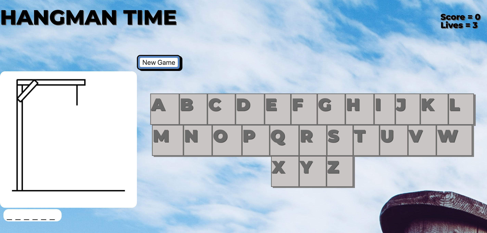

# Project-1

## Overview

For Project 1, I created a simple game of Hangman.

Once players come to the site, they are asked to click New Game to begin playing. The player starts by clicking on a letter from the letter bank. If the letter is in the word, it appears in the correct location at the bottom of the screen. If not, a portion of the hangman appears. They then continue guessing letters until either the player has discovered the word, or the entire hangman is revealed. Once a player wins, their score increases. If they lose, they lose one of their lives. After the player has run out of lives, their final score is shown on screen. 

[Link to project board](https://trello.com/b/EEvT9wXs/ga-project-1-hangman-game)

[Link to live site](http://brandt-campbell-hangman.netlify.com)

## Technologies Used

* Languages - HTML5, CSS, Javascript, jQuery
* Design - Google Fonts
* Project Planning - Trello
* Visual Studio Code

## Features

* Scoreboard
* New Game Button
* Life Counter

## Wireframe

## Future Development

* Make multiplayer version
* Allow user input
* Keep High Score
